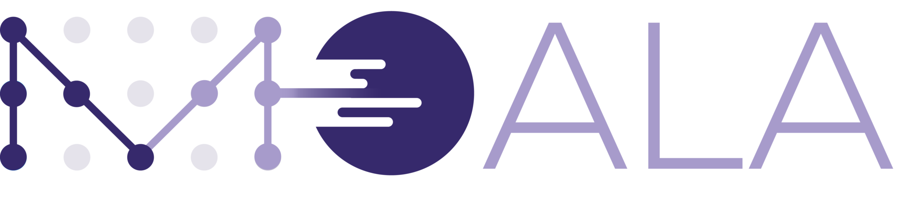

# Introduction

Bienvenue dans la documentation de développement de **MOALA**, dans laquelle vous allez découvrir comment créer des expériences de paiement exceptionneles en utilisant notre API de paiement.

Moala est un agrégateur de paiements opérant dans 4 pays en Afrique (Cameroun, Gabon, Sénégal, Côte d'Ivoire), fournissant des API pour faciliter les transactions entre commerçants et clients. Moala n’a pas d’application dédiée donc elle se concentre sur l’intégration directe avec les systèmes des commerçants.

Les moyens de paiement intégrés à l'API de MOALA sont les suivants :

import React from 'react';

    

        
    

    

        
    

    

        
    

